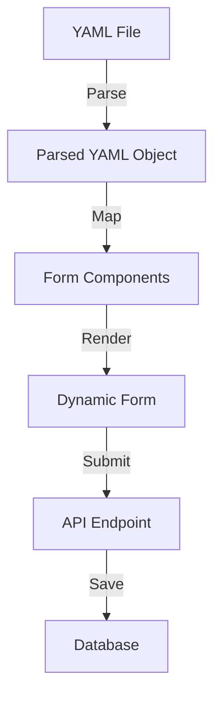

# yaml2form

A TypeScript-based project that converts YAML configurations into dynamic and customizable forms. The repository provides utilities to parse YAML files and generate user-friendly form components. This project also integrates with a database for data persistence and exposes APIs for additional functionalities.

## Table of Contents
  - [Project Overview](#project-overview)
  - [Repository Structure](#repository-structure)
  - [Logic Flow](#logic-flow)
  - [Modules and Components](#modules-and-components)
  - [Diagrams](#diagrams)
  - [Getting Started](#getting-started)
  - [License](#license)

## Project Overview

  **yaml2form** simplifies dynamic form generation by leveraging YAML configurations. It is designed for developers who need customizable forms that integrate seamlessly with their applications.

## Repository Structure

```code
app/
api/
*/route.ts       # API routes
*/page.ts          # Page-level components
page.ts            # Main application entry page
components/
yaml-form.tsx       # Form generation logic
yaml-to-form.tsx    # YAML parsing and mapping
lib/
db.ts               # Database utilities
```

## Logic Flow

The project workflow is divided into three main processes:
1. **YAML Parsing**: Convert YAML files into JavaScript objects using a parsing library.
2. **Form Generation**: Map parsed YAML data to form components.
3. **Data Persistence**: Handle data submission and save it to the database.

## Modules and Components

- **`app/api/*/route.ts`**: Handles API endpoints for data retrieval and submission.
- **`app/*/page.ts`**: Defines page-level routing and layout.
- **`app/page.ts`**: Serves as the entry point for the application.
- **`lib/db.ts`**: Contains database connection logic and utilities.
- **`components/yaml-form.tsx`**: Core logic for dynamically generating forms based on parsed YAML data.
- **`components/yaml-to-form.tsx`**: Transforms YAML configurations into React components.

## Diagrams



## Getting Started
    1.	Clone the repository:

```bash
git clone https://github.com/BarreraSlzr/yaml2form.git
```

	2.	Install dependencies:

```bash
npm install
```

	3.	Run the development server:

```bash
npm run dev
```


## License

This project is licensed under the MIT License.

